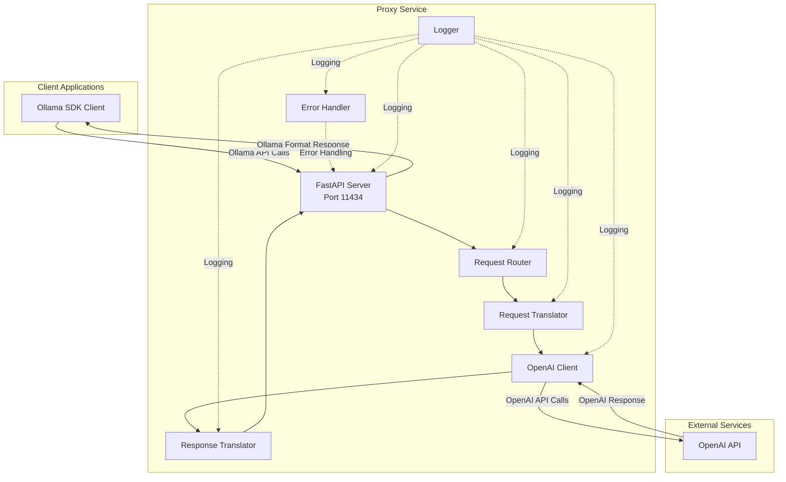
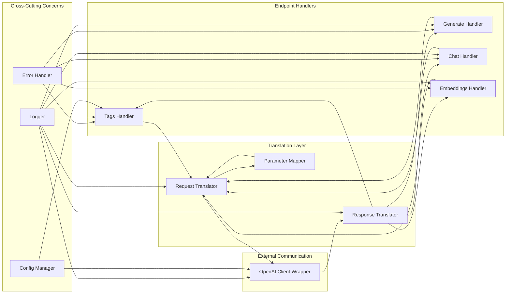
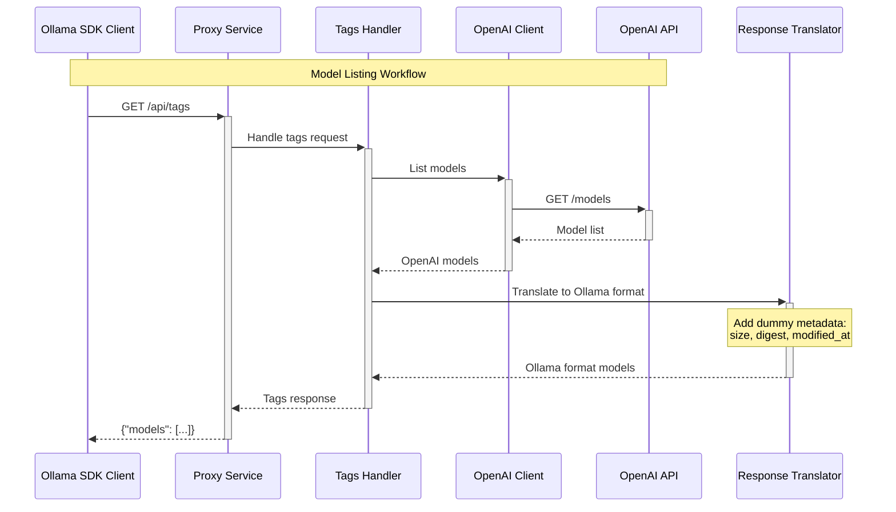

# Ollama-to-OpenAI Proxy Service Architecture Document

## Introduction

This document outlines the overall project architecture for Ollama-to-OpenAI Proxy Service, including backend systems, shared services, and non-UI specific concerns. Its primary goal is to serve as the guiding architectural blueprint for AI-driven development, ensuring consistency and adherence to chosen patterns and technologies.

**Relationship to Frontend Architecture:**
If the project includes a significant user interface, a separate Frontend Architecture Document will detail the frontend-specific design and MUST be used in conjunction with this document. Core technology stack choices documented herein (see "Tech Stack") are definitive for the entire project, including any frontend components.

### Starter Template or Existing Project

N/A - This is a greenfield project built from scratch without any starter template.

### Change Log

| Date | Version | Description | Author |
|------|---------|-------------|--------|
| 2025-01-28 | 1.0 | Initial architecture document | Winston (Architect) |

## High Level Architecture

### Technical Summary

The Ollama-to-OpenAI Proxy Service implements a monolithic REST API translation layer that enables zero-code migration from Ollama to OpenAI-compatible services. Built with FastAPI and Python 3.12, it provides transparent proxy functionality maintaining full Ollama SDK compatibility through request/response translation patterns. The architecture follows KISS principles, avoiding unnecessary complexity while ensuring < 50ms proxy overhead and supporting 100+ concurrent requests. This design directly supports the PRD goal of allowing teams to leverage cloud-scale LLM services without modifying existing Ollama-based codebases.

### High Level Overview

1. **Architectural Style**: Monolithic REST API Service with Translation Layer
2. **Repository Structure**: Monorepo (as per PRD requirement)
3. **Service Architecture**: Single monolithic service handling all proxy functionality
4. **Primary Data Flow**: 
   - Ollama SDK Client → HTTP Request → Proxy Service (port 11434)
   - Request Translation Layer → OpenAI API Client
   - OpenAI Response → Response Translation Layer → Ollama Format Response
5. **Key Architectural Decisions**:
   - Monolithic design for simplicity and reduced operational complexity
   - Stateless service design for horizontal scalability
   - In-memory request/response translation without persistence
   - Direct API-to-API translation without caching layer

### High Level Project Diagram



### Architectural and Design Patterns

- **API Gateway Pattern:** Single entry point for all Ollama API requests - _Rationale:_ Simplifies client configuration and provides centralized request handling
- **Adapter Pattern:** Request/Response translators adapt between Ollama and OpenAI formats - _Rationale:_ Clean separation of translation logic enables independent testing and maintenance
- **Repository Pattern:** Not applicable (no database) - _Rationale:_ KISS principle, avoiding unnecessary persistence layer
- **Dependency Injection:** FastAPI's built-in DI for OpenAI client and configuration - _Rationale:_ Enables easy testing and configuration management
- **Streaming Response Pattern:** Server-Sent Events (SSE) for streaming endpoints - _Rationale:_ Maintains real-time performance for streaming text generation
- **Error Translation Pattern:** Centralized error mapping between API formats - _Rationale:_ Consistent error handling and proper status code translation

## Tech Stack

### Cloud Infrastructure

- **Provider:** On-premises deployment only
- **Key Services:** Docker containers with docker-compose orchestration
- **Deployment Regions:** N/A (on-premises)

### Technology Stack Table

| Category | Technology | Version | Purpose | Rationale |
|----------|------------|---------|---------|-----------|
| **Language** | Python | 3.12.3 | Primary development language | Specified in PRD, excellent async support |
| **Framework** | FastAPI | 0.109.0 | REST API framework | High performance, automatic OpenAPI docs, async support |
| **HTTP Server** | Uvicorn | 0.27.0 | ASGI server | FastAPI recommended, production-ready |
| **HTTP Client** | httpx | 0.26.0 | Async HTTP client | Modern async support, streaming capabilities |
| **OpenAI SDK** | openai | 1.12.0 | OpenAI API client | Official SDK, well-maintained |
| **Validation** | Pydantic | 2.5.3 | Data validation | FastAPI integration, automatic validation |
| **Logging** | structlog | 24.1.0 | Structured logging | JSON logging, better observability |
| **Testing** | pytest | 8.0.0 | Test framework | Python standard, great async support |
| **Testing** | pytest-asyncio | 0.23.3 | Async test support | Required for async endpoint testing |
| **Code Quality** | black | 24.1.1 | Code formatter | Consistent code style |
| **Code Quality** | flake8 | 7.0.0 | Linter | Code quality checks |
| **Code Quality** | mypy | 1.8.0 | Type checker | Static type checking |
| **Containerization** | Docker | 24.0.7 | Container runtime | Deployment standardization |
| **Orchestration** | docker-compose | 2.23.3 | Container orchestration | Simple multi-container management |
| **Environment** | python-dotenv | 1.0.0 | Environment management | .env file support |

**Important Note**: This table represents the DEFINITIVE technology choices. All implementation must use these exact versions to ensure consistency.

## Data Models

### Model: OllamaTagsResponse

**Purpose:** Represents the response format for /api/tags endpoint listing available models

**Key Attributes:**
- models: List[OllamaModel] - List of available models
- OllamaModel.name: str - Model identifier (e.g., "gpt-3.5-turbo")
- OllamaModel.modified_at: str - ISO timestamp of last modification
- OllamaModel.size: int - Model size in bytes (dummy value)
- OllamaModel.digest: str - Model digest hash (dummy value)

**Relationships:**
- Maps from OpenAI model list response
- No persistent storage required

### Model: OllamaGenerateRequest

**Purpose:** Represents the request format for /api/generate text completion endpoint

**Key Attributes:**
- model: str - Model name to use
- prompt: str - Text prompt for generation
- stream: bool - Whether to stream response (default: true)
- options: Dict[str, Any] - Generation parameters (temperature, max_tokens, etc.)

**Relationships:**
- Translates to OpenAI ChatCompletion request
- Parameter mapping required (e.g., num_predict → max_tokens)

### Model: OllamaChatRequest

**Purpose:** Represents the request format for /api/chat conversational endpoint

**Key Attributes:**
- model: str - Model name to use
- messages: List[OllamaChatMessage] - Conversation history
- stream: bool - Whether to stream response
- options: Dict[str, Any] - Generation parameters

**Relationships:**
- Translates to OpenAI ChatCompletion with message history
- Role mapping required (user/assistant/system)

### Model: OllamaEmbeddingRequest

**Purpose:** Represents the request format for /api/embeddings endpoint

**Key Attributes:**
- model: str - Model name to use
- prompt: str | List[str] - Text(s) to embed
- options: Dict[str, Any] - Embedding parameters

**Relationships:**
- Translates to OpenAI Embeddings request
- Batch processing support required

## Components

### API Gateway

**Responsibility:** Main FastAPI application handling all incoming HTTP requests on port 11434

**Key Interfaces:**
- GET /api/tags - List available models
- POST /api/generate - Text generation endpoint
- POST /api/chat - Chat conversation endpoint
- POST /api/embeddings - Text embedding endpoint
- GET /health - Health check endpoint

**Dependencies:** Request Router, Error Handler, Logger

**Technology Stack:** FastAPI 0.109.0, Uvicorn 0.27.0, Pydantic 2.5.3

### Request Router

**Responsibility:** Routes incoming Ollama API requests to appropriate handlers

**Key Interfaces:**
- route_request() - Determines handler based on endpoint
- validate_endpoint() - Ensures endpoint is supported

**Dependencies:** Endpoint Handlers, Logger

**Technology Stack:** FastAPI router, Python 3.12.3

### Request Translator

**Responsibility:** Translates Ollama request formats to OpenAI equivalents

**Key Interfaces:**
- translate_generate_request() - Ollama generate → OpenAI completion
- translate_chat_request() - Ollama chat → OpenAI chat
- translate_embedding_request() - Ollama embedding → OpenAI embedding
- map_parameters() - Parameter name/value translation

**Dependencies:** Pydantic models, Logger

**Technology Stack:** Pydantic 2.5.3, Python dataclasses

### OpenAI Client Wrapper

**Responsibility:** Manages communication with OpenAI API including error handling

**Key Interfaces:**
- list_models() - Fetch available models
- create_completion() - Generate text completion
- create_chat_completion() - Generate chat response
- create_embedding() - Generate embeddings

**Dependencies:** OpenAI SDK, httpx, Logger

**Technology Stack:** openai 1.12.0, httpx 0.26.0

### Response Translator

**Responsibility:** Translates OpenAI responses back to Ollama expected formats

**Key Interfaces:**
- translate_models_response() - OpenAI models → Ollama tags
- translate_completion_response() - OpenAI completion → Ollama generate
- translate_chat_response() - OpenAI chat → Ollama chat
- translate_embedding_response() - OpenAI embedding → Ollama embedding
- format_streaming_chunk() - SSE formatting for streams

**Dependencies:** Pydantic models, Logger

**Technology Stack:** Pydantic 2.5.3, Python 3.12.3

### Error Handler

**Responsibility:** Centralized error handling and translation between API formats

**Key Interfaces:**
- handle_openai_error() - Translate OpenAI errors to Ollama format
- handle_validation_error() - Request validation errors
- handle_connection_error() - Network/timeout errors
- format_error_response() - Consistent error formatting

**Dependencies:** Logger

**Technology Stack:** FastAPI exception handlers, structlog 24.1.0

### Configuration Manager

**Responsibility:** Manages environment variables and application configuration

**Key Interfaces:**
- load_config() - Load from environment/.env
- get_openai_key() - Retrieve API key
- get_server_config() - Port, host, worker settings

**Dependencies:** python-dotenv

**Technology Stack:** python-dotenv 1.0.0, Pydantic Settings

### Component Diagrams



## External APIs

### OpenAI API

- **Purpose:** Provides access to GPT models for text generation, chat, and embeddings
- **Documentation:** https://platform.openai.com/docs/api-reference
- **Base URL(s):** https://api.openai.com/v1
- **Authentication:** Bearer token via Authorization header
- **Rate Limits:** Varies by account tier (not enforced in Phase 1)

**Key Endpoints Used:**
- `GET /models` - List available models
- `POST /chat/completions` - Create chat completion (used for both generate and chat)
- `POST /embeddings` - Create embeddings

**Integration Notes:** No rate limiting or circuit breaker in Phase 1 (KISS principle). API key via environment variable. Streaming responses via Server-Sent Events.

## Core Workflows

```mermaid
sequenceDiagram
    participant Client as Ollama SDK Client
    participant Proxy as Proxy Service
    participant Router as Request Router
    participant ReqTrans as Request Translator
    participant OpenAI as OpenAI Client
    participant API as OpenAI API
    participant RespTrans as Response Translator
    
    Note over Client,API: Text Generation Workflow (Streaming)
    
    Client->>+Proxy: POST /api/generate<br/>{model, prompt, stream: true}
    Proxy->>+Router: Route request
    Router->>+ReqTrans: Translate to OpenAI format
    Note over ReqTrans: Map parameters:<br/>num_predict → max_tokens<br/>temperature → temperature
    ReqTrans->>+OpenAI: Create chat completion request
    OpenAI->>+API: POST /chat/completions<br/>{stream: true}
    
    loop Streaming chunks
        API-->>-OpenAI: SSE chunk
        OpenAI-->>RespTrans: OpenAI chunk
        RespTrans-->>Proxy: Ollama format chunk
        Proxy-->>Client: SSE response chunk
    end
    
    OpenAI-->>-RespTrans: Stream complete
    RespTrans-->>-Router: Format final response
    Router-->>-Proxy: Complete
    Proxy-->>-Client: Stream end
```



## REST API Spec

```yaml
openapi: 3.0.0
info:
  title: Ollama-to-OpenAI Proxy API
  version: 1.0.0
  description: Proxy service translating Ollama API calls to OpenAI
servers:
  - url: http://localhost:11434
    description: Default Ollama port

paths:
  /api/tags:
    get:
      summary: List available models
      operationId: listModels
      responses:
        '200':
          description: List of available models
          content:
            application/json:
              schema:
                type: object
                properties:
                  models:
                    type: array
                    items:
                      type: object
                      properties:
                        name:
                          type: string
                          example: "gpt-3.5-turbo"
                        modified_at:
                          type: string
                          format: date-time
                        size:
                          type: integer
                          example: 1000000
                        digest:
                          type: string
                          example: "sha256:dummy"

  /api/generate:
    post:
      summary: Generate text completion
      operationId: generateCompletion
      requestBody:
        required: true
        content:
          application/json:
            schema:
              type: object
              required:
                - model
                - prompt
              properties:
                model:
                  type: string
                  example: "gpt-3.5-turbo"
                prompt:
                  type: string
                  example: "Why is the sky blue?"
                stream:
                  type: boolean
                  default: true
                options:
                  type: object
                  properties:
                    temperature:
                      type: number
                      example: 0.7
                    num_predict:
                      type: integer
                      example: 100
      responses:
        '200':
          description: Generated text
          content:
            application/json:
              schema:
                type: object
                properties:
                  model:
                    type: string
                  created_at:
                    type: string
                    format: date-time
                  response:
                    type: string
                  done:
                    type: boolean

  /api/chat:
    post:
      summary: Chat conversation
      operationId: chatCompletion
      requestBody:
        required: true
        content:
          application/json:
            schema:
              type: object
              required:
                - model
                - messages
              properties:
                model:
                  type: string
                messages:
                  type: array
                  items:
                    type: object
                    properties:
                      role:
                        type: string
                        enum: [system, user, assistant]
                      content:
                        type: string
                stream:
                  type: boolean
                  default: true
      responses:
        '200':
          description: Chat response

  /api/embeddings:
    post:
      summary: Generate embeddings
      operationId: createEmbeddings
      requestBody:
        required: true
        content:
          application/json:
            schema:
              type: object
              required:
                - model
                - prompt
              properties:
                model:
                  type: string
                  example: "text-embedding-ada-002"
                prompt:
                  oneOf:
                    - type: string
                    - type: array
                      items:
                        type: string
      responses:
        '200':
          description: Embeddings response

  /health:
    get:
      summary: Health check
      operationId: healthCheck
      responses:
        '200':
          description: Service is healthy
          content:
            application/json:
              schema:
                type: object
                properties:
                  status:
                    type: string
                    example: "healthy"
                  version:
                    type: string
                    example: "1.0.0"
```

## Database Schema

Not applicable - This service operates entirely stateless without any database requirements, following the KISS principle.

## Source Tree

```plaintext
ollama-openai-proxy/
├── src/
│   ├── __init__.py
│   ├── main.py                    # FastAPI application entry point
│   ├── config.py                  # Configuration management
│   ├── models/                    # Pydantic models
│   │   ├── __init__.py
│   │   ├── ollama.py             # Ollama request/response models
│   │   └── openai.py             # OpenAI request/response models
│   ├── handlers/                  # Endpoint handlers
│   │   ├── __init__.py
│   │   ├── tags.py               # /api/tags handler
│   │   ├── generate.py           # /api/generate handler
│   │   ├── chat.py               # /api/chat handler
│   │   └── embeddings.py         # /api/embeddings handler
│   ├── translators/              # Translation logic
│   │   ├── __init__.py
│   │   ├── request.py            # Ollama → OpenAI translation
│   │   ├── response.py           # OpenAI → Ollama translation
│   │   └── parameters.py         # Parameter mapping
│   ├── clients/                  # External API clients
│   │   ├── __init__.py
│   │   └── openai_client.py     # OpenAI API wrapper
│   ├── utils/                    # Utilities
│   │   ├── __init__.py
│   │   ├── errors.py             # Error handling
│   │   └── logging.py            # Logging configuration
│   └── middleware/               # FastAPI middleware
│       ├── __init__.py
│       └── logging.py            # Request/response logging
├── tests/                        # Test suite
│   ├── __init__.py
│   ├── conftest.py              # Pytest configuration
│   ├── unit/                    # Unit tests
│   │   ├── test_translators.py
│   │   ├── test_handlers.py
│   │   └── test_models.py
│   ├── integration/             # Integration tests
│   │   ├── test_ollama_sdk.py  # Tests using Ollama SDK
│   │   └── test_endpoints.py
│   └── fixtures/                # Test fixtures
│       ├── ollama_requests.json
│       └── openai_responses.json
├── scripts/                     # Development scripts
│   ├── setup_dev.sh            # Development environment setup
│   ├── run_tests.sh            # Run test suite
│   └── run_local.sh            # Run local server
├── docs/                       # Documentation
│   ├── architecture.md         # This document
│   ├── api.md                 # API documentation
│   └── deployment.md          # Deployment guide
├── docker/                    # Docker configuration
│   ├── Dockerfile            # Production container
│   └── Dockerfile.dev        # Development container
├── .env.example              # Environment variable template
├── .gitignore               # Git ignore file
├── docker-compose.yml       # Container orchestration
├── requirements.txt         # Python dependencies
├── requirements-dev.txt     # Development dependencies
├── pyproject.toml          # Python project configuration
├── setup.py                # Package setup
└── README.md               # Project documentation
```

## Infrastructure and Deployment

### Infrastructure as Code

- **Tool:** Docker 24.0.7 & docker-compose 2.23.3
- **Location:** `docker/` and `docker-compose.yml`
- **Approach:** Container-based deployment with environment variable configuration

### Deployment Strategy

- **Strategy:** Rolling update with Docker Compose
- **CI/CD Platform:** Manual deployment (automated CI/CD out of scope for Phase 1)
- **Pipeline Configuration:** `scripts/deploy.sh` (to be created)

### Environments

- **Development:** Local Docker container with hot-reload enabled - Port 11434, debug logging
- **Testing:** Docker container with test configuration - Isolated network, test OpenAI credentials
- **Production:** Optimized Docker container - Port 11434, JSON structured logging, restart policy

### Environment Promotion Flow

```
Development (local) → Testing (docker) → Production (docker)
    ↓                    ↓                    ↓
  Manual              Manual              Manual
  Testing             Validation          Deployment
```

### Rollback Strategy

- **Primary Method:** Docker image rollback to previous version
- **Trigger Conditions:** Health check failures, high error rate, manual intervention
- **Recovery Time Objective:** < 5 minutes

## Error Handling Strategy

### General Approach

- **Error Model:** Centralized error handling with consistent response format
- **Exception Hierarchy:** Custom exceptions for Ollama/OpenAI translation errors
- **Error Propagation:** Catch at handler level, translate, return appropriate HTTP status

### Logging Standards

- **Library:** structlog 24.1.0
- **Format:** JSON structured logging
- **Levels:** DEBUG, INFO, WARNING, ERROR
- **Required Context:**
  - Correlation ID: UUID per request
  - Service Context: endpoint, method, duration
  - User Context: No PII, only model name and request type

### Error Handling Patterns

#### External API Errors

- **Retry Policy:** No automatic retry (KISS principle)
- **Circuit Breaker:** Not implemented in Phase 1
- **Timeout Configuration:** 30 seconds for OpenAI API calls
- **Error Translation:** Map OpenAI errors to Ollama error format

#### Business Logic Errors

- **Custom Exceptions:** TranslationError, UnsupportedParameterError
- **User-Facing Errors:** Simple error messages without internal details
- **Error Codes:** HTTP status codes only (400, 404, 500, 502)

#### Data Consistency

- **Transaction Strategy:** N/A (stateless service)
- **Compensation Logic:** N/A (no state modifications)
- **Idempotency:** All endpoints naturally idempotent

## Coding Standards

### Core Standards

- **Languages & Runtimes:** Python 3.12.3
- **Style & Linting:** black (formatting), flake8 (linting), mypy (type checking)
- **Test Organization:** tests/{unit,integration}/test_*.py pattern

### Naming Conventions

| Element | Convention | Example |
|---------|------------|---------|
| Files | snake_case | request_translator.py |
| Classes | PascalCase | RequestTranslator |
| Functions | snake_case | translate_request |
| Constants | UPPER_SNAKE | MAX_RETRIES |
| Test files | test_*.py | test_translator.py |

### Critical Rules

- **Logging:** Never use print() - always use structured logger
- **Secrets:** Never log API keys or sensitive data
- **Error Handling:** All endpoints must have explicit error handling
- **Type Hints:** All functions must have type hints
- **Docstrings:** All public functions must have docstrings
- **Async:** Use async/await for all I/O operations

## Test Strategy and Standards

### Testing Philosophy

- **Approach:** Test-after development with comprehensive coverage
- **Coverage Goals:** 80% minimum coverage, 100% for translation logic
- **Test Pyramid:** 60% unit, 30% integration, 10% end-to-end

### Test Types and Organization

#### Unit Tests

- **Framework:** pytest 8.0.0
- **File Convention:** test_<module_name>.py
- **Location:** tests/unit/
- **Mocking Library:** pytest-mock
- **Coverage Requirement:** 80% minimum

**AI Agent Requirements:**
- Generate tests for all public methods
- Cover edge cases and error conditions
- Follow AAA pattern (Arrange, Act, Assert)
- Mock all external dependencies

#### Integration Tests

- **Scope:** API endpoint testing with Ollama SDK client
- **Location:** tests/integration/
- **Test Infrastructure:**
  - **OpenAI API:** Mock responses via pytest fixtures
  - **HTTP Server:** Test client via FastAPI TestClient

#### End-to-End Tests

- **Framework:** pytest 8.0.0 with real OpenAI API
- **Scope:** Full request/response flow with actual API
- **Environment:** Requires .env with valid OPENAI_API_KEY
- **Test Data:** Minimal API calls to control costs

### Test Data Management

- **Strategy:** Fixtures from Postman collection examples
- **Fixtures:** tests/fixtures/*.json
- **Factories:** Not required (simple data structures)
- **Cleanup:** No cleanup needed (stateless)

### Continuous Testing

- **CI Integration:** Run all tests before deployment
- **Performance Tests:** Basic load test with locust (Epic 3)
- **Security Tests:** Dependency scanning with pip-audit

## Security

### Input Validation

- **Validation Library:** Pydantic (built-in with FastAPI)
- **Validation Location:** At API boundary via Pydantic models
- **Required Rules:**
  - All external inputs MUST be validated
  - Validation at API boundary before processing
  - Whitelist approach preferred over blacklist

### Authentication & Authorization

- **Auth Method:** API key via environment variable (OpenAI)
- **Session Management:** Stateless - no sessions
- **Required Patterns:**
  - API key must be loaded from environment only
  - Never expose API key in logs or responses

### Secrets Management

- **Development:** .env file (never committed)
- **Production:** Environment variables via Docker
- **Code Requirements:**
  - NEVER hardcode secrets
  - Access via configuration service only
  - No secrets in logs or error messages

### API Security

- **Rate Limiting:** Not implemented (Phase 1 KISS)
- **CORS Policy:** Disabled (backend service only)
- **Security Headers:** Default FastAPI security headers
- **HTTPS Enforcement:** Handled by deployment infrastructure

### Data Protection

- **Encryption at Rest:** N/A (no data storage)
- **Encryption in Transit:** HTTPS to OpenAI API
- **PII Handling:** No PII storage, prompts not logged
- **Logging Restrictions:** No request/response bodies in logs

### Dependency Security

- **Scanning Tool:** pip-audit
- **Update Policy:** Monthly security updates
- **Approval Process:** Review all new dependencies

### Security Testing

- **SAST Tool:** bandit (Python security linter)
- **DAST Tool:** Not required (API only)
- **Penetration Testing:** Not planned for Phase 1

## Checklist Results Report

*To be completed after architecture validation*

## Next Steps

### For All Projects:
1. Review this architecture with Product Owner
2. Set up development environment per Story 1.1
3. Begin Ollama API contract analysis per Story 1.2
4. Implement endpoints incrementally per Epic 2
5. Prepare for production deployment per Epic 3

### Specific Development Prompts:
- **Developer Agent:** "Implement the Ollama-to-OpenAI proxy service following the architecture document. Start with Story 1.1 (Project Infrastructure Setup) and follow the incremental development approach. Pay special attention to Story 1.2 (Ollama API Contract Analysis) as it's a blocker for all endpoint development."
- **DevOps Agent:** "Set up Docker containers and docker-compose configuration for the Ollama proxy service as specified in the architecture. Focus on development environment first, then production optimization."