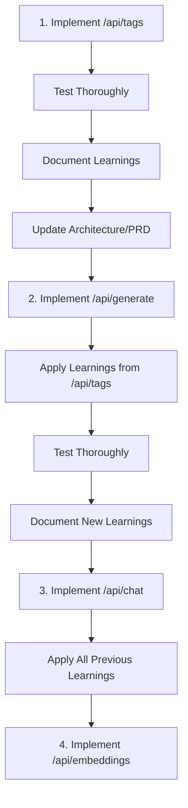

# Ollama to OpenAI Proxy Service - Architecture Document

## 1. System Overview

### 1.1 Architecture Goals
- **Transparency**: Act as a seamless proxy between Ollama SDK and OpenAI API
- **Simplicity**: Minimal components with clear responsibilities (KISS principle)
- **Performance**: Low latency overhead with efficient streaming support
- **Maintainability**: Clean separation of concerns with testable components

### 1.2 Core Development Principles
```
CRITICAL PRINCIPLES FOR ALL DEVELOPMENT:

1. KISS (Keep It Simple, Stupid)
   - Choose the simplest solution that works
   - Avoid over-engineering
   - If it's not needed NOW, don't build it
   
2. YAGNI (You Aren't Gonna Need It)
   - Build ONLY what the current story requires
   - No "future-proofing" features
   - No "while we're at it" additions
   - If PRD doesn't require it, don't implement it

3. Story-Driven Development
   - Each story defines its exact scope
   - Implement ONLY what's in the story
   - Future features belong in future stories
   
Example:
❌ "Let's add caching while implementing /api/generate"
✅ "Story says implement /api/generate. No caching mentioned. Skip it."

❌ "This could be useful later for multi-tenancy"
✅ "Current story is single-tenant. Implement single-tenant only."
```

### 1.3 High-Level Architecture

```
┌─────────────────┐     ┌──────────────────────────────────────┐     ┌─────────────────┐
│   Ollama SDK    │────▶│       Ollama-OpenAI Proxy            │────▶│   OpenAI API    │
│   Python Client │     │  ┌────────────┐  ┌────────────────┐ │     │                 │
└─────────────────┘     │  │  FastAPI   │  │  Translation   │ │     └─────────────────┘
                        │  │  Server     │──│     Layer      │ │
                        │  └────────────┘  └────────────────┘ │
                        │         │                │           │
                        │         ▼                ▼           │
                        │  ┌────────────┐  ┌────────────────┐ │
                        │  │   Request  │  │  OpenAI SDK    │ │
                        │  │  Validator │  │    Client      │ │
                        │  └────────────┘  └────────────────┘ │
                        └──────────────────────────────────────┘
```

## 2. Component Architecture

### 2.1 FastAPI Server Layer

#### 2.1.1 Endpoints Implementation
```python
# Core endpoints structure
app = FastAPI(title="Ollama-OpenAI Proxy")

@app.get("/api/tags")
async def list_models() -> OllamaTagsResponse

@app.post("/api/generate")
async def generate(request: OllamaGenerateRequest) -> OllamaGenerateResponse

@app.post("/api/chat")
async def chat(request: OllamaChatRequest) -> OllamaChatResponse

@app.post("/api/embeddings")
async def embeddings(request: OllamaEmbeddingsRequest) -> OllamaEmbeddingsResponse
```

#### 2.1.2 Request/Response Models
```python
# Pydantic models for type safety and validation
class OllamaGenerateRequest(BaseModel):
    model: str
    prompt: str
    stream: bool = False
    options: Optional[Dict[str, Any]] = None
    
class OllamaTagsResponse(BaseModel):
    models: List[ModelInfo]
    
class ModelInfo(BaseModel):
    name: str
    size: int = 0  # Dummy value
    digest: str = "unknown"
    modified_at: str
```

### 2.2 Translation Layer

#### 2.2.1 Pydantic Model Generation (CRITICAL FIRST STEP)
```
IMPORTANT: All Ollama API models MUST be generated from Ollama's swagger specification
- Do NOT hand-write these models
- Must match exactly what Ollama SDK sends/expects
- Any mismatch will cause integration test failures
- This is the FIRST development story
```

#### 2.2.2 Request Translation
```python
class RequestTranslator:
    """Converts Ollama requests to OpenAI format"""
    
    def translate_generate_request(self, ollama_req: OllamaGenerateRequest) -> OpenAICompletionRequest:
        # Parameter mapping with logging for unsupported params
        
    def translate_chat_request(self, ollama_req: OllamaChatRequest) -> OpenAIChatRequest:
        # Message format conversion
        
    def translate_embedding_request(self, ollama_req: OllamaEmbeddingRequest) -> OpenAIEmbeddingRequest:
        # Batch handling and format conversion
```

#### 2.2.2 Response Translation
```python
class ResponseTranslator:
    """Converts OpenAI responses to Ollama format"""
    
    def translate_completion_response(self, openai_resp: OpenAIResponse) -> OllamaGenerateResponse:
        # Format response with proper field mapping
        
    def translate_chat_response(self, openai_resp: OpenAIChatResponse) -> OllamaChatResponse:
        # Handle message structure differences
        
    def translate_models_list(self, openai_models: List[OpenAIModel]) -> OllamaTagsResponse:
        # Create Ollama-compatible model list with dummy metadata
```

#### 2.2.3 Parameter Mapping Table
| Ollama Parameter | OpenAI Parameter | Notes |
|-----------------|------------------|-------|
| `num_predict` | `max_tokens` | Direct mapping |
| `temperature` | `temperature` | Direct mapping |
| `top_p` | `top_p` | Direct mapping |
| `repeat_penalty` | `frequency_penalty` | Requires value adjustment |
| `repeat_last_n` | - | Log warning, no equivalent |
| `top_k` | - | Log warning, no equivalent |
| `seed` | `seed` | If supported by model |
| `stop` | `stop` | Array format |
| `tfs_z` | - | Log warning, no equivalent |
| `num_ctx` | - | Log warning, context handled differently |

### 2.3 OpenAI Client Integration

#### 2.3.1 Client Configuration
```python
class OpenAIClientWrapper:
    def __init__(self):
        self.client = OpenAI(
            api_key=os.getenv("OPENAI_API_KEY"),
            base_url=os.getenv("OPENAI_API_BASE_URL", "https://api.openai.com/v1")
        )
        
    async def list_models(self) -> List[Model]:
        return await self.client.models.list()
        
    async def create_completion(self, **kwargs) -> CompletionResponse:
        return await self.client.completions.create(**kwargs)
```

#### 2.3.2 Streaming Handler
```python
class StreamingHandler:
    """Handles streaming responses with format conversion"""
    
    async def stream_generate_response(self, openai_stream):
        async for chunk in openai_stream:
            # Convert OpenAI chunk to Ollama format
            yield self.format_ollama_chunk(chunk)
            
    def format_ollama_chunk(self, openai_chunk) -> str:
        # Return JSON lines format expected by Ollama SDK
        return json.dumps({
            "model": openai_chunk.model,
            "created_at": datetime.utcnow().isoformat(),
            "response": openai_chunk.choices[0].delta.content or "",
            "done": openai_chunk.choices[0].finish_reason is not None
        })
```

## 3. Data Flow Architecture

### 3.1 Request Flow
```
1. Ollama SDK sends request to proxy
2. FastAPI validates request structure
3. RequestTranslator converts to OpenAI format
   - Maps parameters
   - Logs warnings for unsupported params
4. OpenAIClient sends request to OpenAI API
5. Response flows back through ResponseTranslator
6. FastAPI returns Ollama-formatted response
```

### 3.2 Streaming Flow
```
1. Detect stream=true in request
2. Establish SSE connection with client
3. Create streaming request to OpenAI
4. Transform each chunk in real-time
5. Send formatted chunks to client
6. Close connection on completion
```

## 4. Error Handling Architecture

### 4.1 Error Translation Map
```python
ERROR_MAPPING = {
    # OpenAI Error -> Ollama Error
    "invalid_api_key": (401, "Invalid API key"),
    "model_not_found": (404, "Model not found"),
    "rate_limit_exceeded": (429, "Rate limit exceeded"),
    "invalid_request_error": (400, "Bad request"),
    "server_error": (500, "Internal server error"),
}
```

### 4.2 Error Handler Implementation
```python
class ErrorHandler:
    def translate_openai_error(self, openai_error: OpenAIError) -> OllamaError:
        error_type = openai_error.type
        status_code, message = ERROR_MAPPING.get(
            error_type, 
            (500, f"Unexpected error: {openai_error.message}")
        )
        
        return OllamaError(
            error=message,
            status_code=status_code
        )
```

### 4.3 Phase 1 Error Handling Approach
```
IMPORTANT: Following KISS/YAGNI principles for Phase 1:

- Simple error translation as shown above
- Direct pass-through of OpenAI errors with mapping
- No circuit breakers (Phase 2 feature)
- No retry logic beyond max_retries config
- No complex fallback mechanisms

If OpenAI is down:
- Return appropriate error to client
- Let client handle retry logic
- Log the error for monitoring

This approach keeps Phase 1 simple and focused on core proxy functionality.
```

## 5. Configuration Architecture

### 5.1 Environment Configuration
```python
class Config:
    """Application configuration from environment"""
    
    # OpenAI Configuration
    openai_api_key: str = Field(..., env="OPENAI_API_KEY")
    openai_base_url: str = Field(default="https://api.openai.com/v1", env="OPENAI_API_BASE_URL")
    default_model: str = Field(default="gpt-3.5-turbo", env="DEFAULT_MODEL")
    
    # Server Configuration
    port: int = Field(default=11434, env="PORT")  # Ollama default
    host: str = Field(default="0.0.0.0", env="HOST")
    
    # Logging Configuration
    log_level: str = Field(default="INFO", env="LOG_LEVEL")
    log_format: str = Field(default="json", env="LOG_FORMAT")
    
    # Request Configuration
    request_timeout: int = Field(default=600, env="REQUEST_TIMEOUT")
    max_retries: int = Field(default=3, env="MAX_RETRIES")
```

### 5.2 Logging Architecture
```python
# SIMPLE structured logging - no complex logging frameworks
logger = structlog.get_logger()

# Log only what's needed for debugging and monitoring
# No "might be useful" logs

# Required logs:
# - Parameter translation warnings
# - API errors
# - Request/response (if debugging)

# NOT required (don't implement):
# - Performance metrics (Phase 2)
# - Detailed tracing (not in requirements)
# - Analytics (not in requirements)
```

## 6. Testing Architecture

### 6.1 Integration Test Structure
```python
class OllamaSDKIntegrationTests:
    """Tests using actual Ollama SDK as client"""
    
    def setup(self):
        # Configure Ollama SDK to point to proxy
        self.client = ollama.Client(host="http://localhost:11434")
        
    async def test_generate_compatibility(self):
        # Test all Ollama SDK generate features
        
    async def test_streaming_compatibility(self):
        # Verify streaming works with SDK
        
    async def test_parameter_handling(self):
        # Ensure warnings logged for unsupported params
```

### 6.2 Unit Test Structure
```python
# Component-level testing
- test_request_translator.py
- test_response_translator.py  
- test_parameter_mapping.py
- test_error_handling.py
- test_streaming_handler.py
```

## 7. Deployment Architecture

### 7.1 Container Structure
```dockerfile
FROM python:3.11-slim

# Install dependencies
COPY requirements.txt .
RUN pip install -r requirements.txt

# Copy application
COPY ./app /app

# Run with uvicorn
CMD ["uvicorn", "app.main:app", "--host", "0.0.0.0", "--port", "11434"]
```

### 7.2 Docker Compose Example
```yaml
version: '3.8'
services:
  ollama-proxy:
    build: .
    ports:
      - "11434:11434"
    env_file:
      - .env
    restart: unless-stopped
    healthcheck:
      test: ["CMD", "curl", "-f", "http://localhost:11434/health"]
      interval: 30s
      timeout: 10s
      retries: 3
```

### 7.3 Deployment and Rollback Strategy
```
IMPORTANT: Following KISS principle for Phase 1

Deployment and rollback procedures will be:
- Defined by the Scrum Master (SM) and Development team
- Based on the specific infrastructure and constraints
- Documented as part of the deployment story
- NOT pre-architected in this document

This allows flexibility for the team to choose the most appropriate approach
based on their actual deployment environment (cloud provider, on-prem, etc.)

Basic requirements:
- Container-based deployment using Docker
- Environment-based configuration
- Health check endpoint for monitoring
- Simple restart capability

The SM and DEV team will determine:
- Specific deployment procedures
- Rollback mechanisms
- Version tagging strategy
- Environment-specific configurations
```

## 8. Performance Considerations

### 8.1 Optimization Strategies
- **Connection Pooling**: Reuse OpenAI client connections
- **Async Processing**: Full async/await implementation
- **Minimal Overhead**: Direct streaming without buffering
- **Efficient JSON Parsing**: Use orjson for performance

### 8.2 Resource Requirements
- **Memory**: ~100MB base + request overhead
- **CPU**: Minimal, mostly I/O bound
- **Network**: Low latency to OpenAI API endpoint
- **Disk**: Minimal, only for logs

## 9. Security Architecture

### 9.1 API Key Handling
- Store API keys in environment variables only
- Never log API keys
- Validate API key format on startup
- Support key rotation without restart

### 9.2 Request Validation
- Validate all input parameters
- Sanitize model names
- Prevent injection attacks
- Rate limiting (Phase 2)

## 10. Monitoring Architecture (Phase 2)

### 10.1 Metrics to Track
```python
# Prometheus metrics
request_count = Counter('ollama_proxy_requests_total', 'Total requests', ['endpoint', 'model'])
request_duration = Histogram('ollama_proxy_request_duration_seconds', 'Request duration', ['endpoint'])
error_count = Counter('ollama_proxy_errors_total', 'Total errors', ['endpoint', 'error_type'])
active_connections = Gauge('ollama_proxy_active_connections', 'Active connections')
```

### 10.2 Health Check Endpoint (Phase 1)
```python
@app.get("/health")
async def health_check():
    """
    PHASE 1: Basic health check for Docker only
    - No OpenAI connection verification
    - No resource checking
    - Just return 200 OK
    """
    return {"status": "healthy"}

# That's it. KISS principle.
# Phase 2 can add connection checks, metrics, etc.
```

## 11. Development Guidelines

### 11.1 Development Environment Requirements
```bash
# IMPORTANT: Development environment specifications
# OS: Linux only (Ubuntu 22.04 LTS recommended)
# Python: 3.12 (exact version required)
# Package Management: venv (virtual environment)

# Setup commands for developers
python3.12 -m venv venv
source venv/bin/activate  # ALWAYS activate venv before any Python work
pip install -r requirements.txt
pip install -r requirements-dev.txt  # Development dependencies
```

### 11.2 Code Structure
```
ollama-openai-proxy/
├── app/
│   ├── main.py              # FastAPI app entry point
│   ├── config.py            # Configuration management
│   ├── models/              # Pydantic models for validation
│   ├── translators/         # Translation logic (core business logic)
│   ├── handlers/            # Request handlers for each endpoint
│   ├── clients/             # OpenAI client wrapper
│   └── utils/               # Shared utilities and helpers
├── tests/
│   ├── integration/         # Ollama SDK tests (MUST PASS)
│   └── unit/               # Component tests (MUST PASS)
├── scripts/
│   ├── setup_dev.sh        # Development environment setup
│   ├── run_tests.sh        # Run all tests
│   └── run_local.sh        # Run proxy locally for testing
├── docker/
├── docs/
├── .env.example             # Example environment configuration
├── requirements.txt         # Production dependencies
└── requirements-dev.txt     # Development dependencies (pytest, etc.)
```

### 11.3 Development Workflow - INCREMENTAL APPROACH

**CRITICAL: Complete ONE API endpoint at a time, learning and updating as we go**

#### Phase 0: Ollama API Contract Analysis (FIRST STORY)
```
PREREQUISITE: Understand Ollama's exact API contract
- Obtain Ollama server swagger/OpenAPI specification  
- Generate Pydantic models from the specification
- Validate models against Ollama SDK expectations
- Create test fixtures from real Ollama responses

This MUST be completed before ANY endpoint implementation
Expected deliverables:
- Validated Pydantic models matching Ollama API
- Test fixtures for integration testing
- Documentation of findings and edge cases
```

#### Phase 1: `/api/tags` Endpoint (Learning Phase)
```bash
# NOW we can implement with confidence
# 1. Use validated Pydantic models from Phase 0
# 2. Write comprehensive tests
# 3. Learn from implementation challenges
# 4. Update architecture/PRD based on learnings
# 5. Apply lessons to next endpoint
```

#### Development Checklist for EACH Endpoint:
```python
# FOR SCRUM MASTER: A story is NOT complete until ALL items are checked:
# [ ] Endpoint handler implemented
# [ ] Request/Response models defined
# [ ] Translation logic implemented
# [ ] Unit tests written and PASSING
# [ ] Integration tests with Ollama SDK PASSING
# [ ] Error handling tested
# [ ] Logging implemented
# [ ] Local testing completed
# [ ] Architecture document updated with learnings
# [ ] Code reviewed by peer

# NO STORY MOVES TO "DONE" WITHOUT PASSING TESTS!
```

### 11.4 Testing Requirements

#### 11.4.1 Test Execution (ALWAYS from venv)
```bash
# IMPORTANT: All test commands MUST be run from activated venv
source venv/bin/activate

# Run unit tests for specific component
pytest tests/unit/test_<component>.py -v

# Run integration tests for specific endpoint
pytest tests/integration/test_<endpoint>_integration.py -v

# Run all tests (required before marking story complete)
pytest tests/ -v --cov=app --cov-report=term-missing

# Test coverage must be >80% for each component
```

#### 11.4.2 Local Testing Procedure
```bash
# 1. Start the proxy locally (from venv)
source venv/bin/activate
python -m app.main  # or use run_local.sh

# 2. In another terminal, run integration tests
source venv/bin/activate
pytest tests/integration/ -v

# 3. Manual testing with Ollama SDK
python test_scripts/manual_ollama_test.py
```

### 11.5 Development Best Practices

```python
# IMPORTANT REMINDERS FOR DEVELOPERS:

# 1. ALWAYS work in venv
"""
Before ANY Python command:
$ source venv/bin/activate
(venv) $ python ...  # Note the (venv) prefix
"""

# 2. Test-Driven Development
"""
- Write tests FIRST or alongside implementation
- No code merges without tests
- Integration tests are MANDATORY
"""

# 3. Incremental Development
"""
- Complete /api/tags FULLY before starting /api/generate
- Document learnings in architecture_learnings.md
- Update this architecture doc with discoveries
"""

# 4. Local First, CI/CD Later
"""
- All testing happens locally first
- GitHub Actions CI/CD comes AFTER local success
- No shortcuts - local must work perfectly
"""

# 5. KISS Principle Enforcement
"""
- Always choose the simplest working solution
- Reject complex solutions in code reviews
- "Clever" code is bad code
- If you can't explain it simply, it's too complex
"""

# 6. No Premature Features
"""
- Build ONLY what the story specifies
- No "might be useful later" code
- No unused parameters or configurations
- Delete any code not required by current stories
"""
```

### 11.6 Code Review Checklist
```
For Reviewers - REJECT if:
□ Code implements features not in the current story
□ "Future-proofing" code that isn't currently used
□ Complex solution when simple one would work
□ Configuration options that aren't needed NOW
□ Abstractions without current concrete use cases
□ "Nice to have" additions not in requirements

APPROVE only if:
✓ Implements EXACTLY what the story requires
✓ Uses simplest possible approach
✓ No unused code or features
✓ All code has a current purpose
✓ Tests cover actual requirements only
```

### 11.6 Development Order and Learning Loop



### 11.7 Story Definition of Done

**FOR SCRUM MASTER - A story is DONE when:**
1. ✅ Code implemented according to architecture
2. ✅ All unit tests passing (from venv)
3. ✅ Integration tests with Ollama SDK passing (from venv)
4. ✅ Error scenarios tested and handled
5. ✅ Logging implemented with appropriate levels
6. ✅ Local end-to-end testing completed
7. ✅ Architecture/PRD updated if needed
8. ✅ Code reviewed and approved
9. ✅ NO "we'll fix it later" items

### 11.8 Common Development Commands

```bash
# Development command reference (ALWAYS in venv)

# Setup new development environment
./scripts/setup_dev.sh

# Run specific endpoint locally for testing
ENDPOINT=tags python -m app.main

# Run tests with coverage
pytest --cov=app --cov-report=html

# Check code quality
flake8 app/
black app/ --check
mypy app/

# Run integration test against local instance
./scripts/test_endpoint.sh tags

# View logs during development
tail -f logs/ollama_proxy.log | jq '.'
```

## 12. CI/CD Strategy (Post-Local Development)

### 12.1 Local First Approach
```yaml
# IMPORTANT: CI/CD implementation comes AFTER:
# 1. All endpoints implemented and tested locally
# 2. Full integration test suite passing locally
# 3. Development team confident in stability

# NO CI/CD until local development is SOLID!
```

### 12.2 Future CI/CD Pipeline (Phase 2)
- GitHub Actions for automated testing
- Docker image building
- Automated deployment
- But NOT NOW - focus on local development first

## 13. Architecture Learning Document

### 13.1 Learning Documentation
```markdown
# Each endpoint implementation should update:
docs/architecture_learnings.md

## Learnings from /api/tags
- [Document surprises, challenges, solutions]
- [Parameter mapping discoveries]
- [Ollama SDK quirks found]

## Learnings from /api/generate
- [Streaming implementation insights]
- [Parameter translation edge cases]
- [Performance observations]

# These learnings MUST be incorporated into next endpoint
```

## 14. Future Considerations (NOT FOR PHASE 1)

### 14.1 Out of Scope for Current Development
```
IMPORTANT: These are ideas for FUTURE phases only
Do NOT implement any of these in Phase 1:

- Circuit breaker patterns
- Retry logic with exponential backoff
- Fallback responses or caching
- Multi-provider support (Anthropic, Cohere)
- Request caching
- Advanced model routing  
- Load balancing
- WebSocket support
- Multi-tenancy
- Advanced monitoring
- Kubernetes manifests
- CI/CD pipelines

If it's listed here, it's FORBIDDEN in Phase 1
Focus on the core proxy functionality ONLY
```

### 14.2 Phase 1 Scope Reminder
```
Phase 1 includes ONLY:
- Four endpoints: /api/tags, /api/generate, /api/chat, /api/embeddings
- Basic error handling
- Simple environment variable configuration
- Ollama SDK compatibility
- Basic logging for debugging

Nothing else. Keep it simple.
```

## 16. Appendix: Development Prerequisites

### 16.1 Before Starting Development
```
Critical Requirements:
- Ollama swagger.json must be obtained and analyzed
- Pydantic models must be generated (not hand-written)
- Models must be validated against Ollama SDK
- Test fixtures must be created from real Ollama server

The development team will determine the best approach for:
- Obtaining the Ollama API specification
- Generating accurate Pydantic models
- Creating comprehensive test fixtures
- Validating compatibility
```