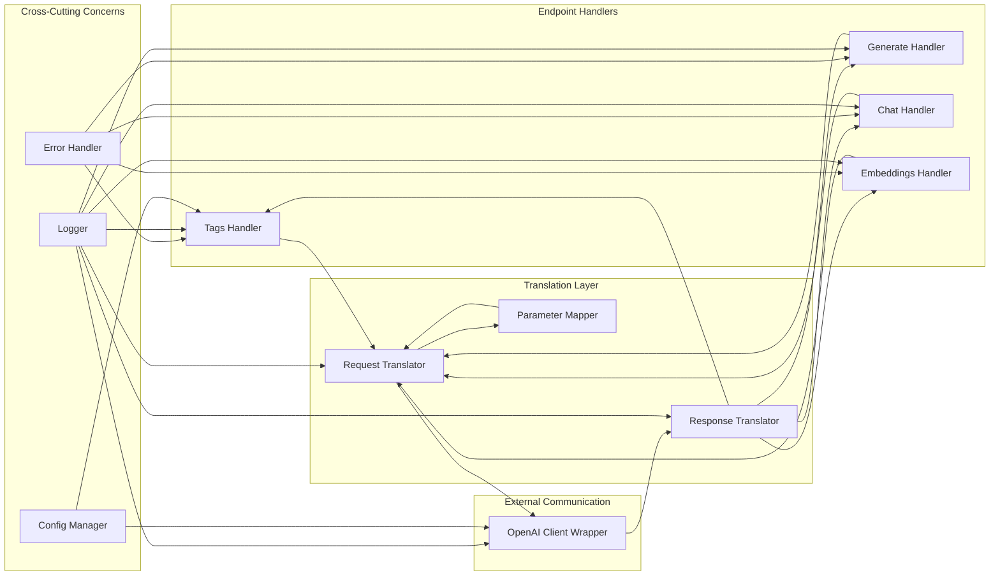

# Components

## API Gateway

**Responsibility:** Main FastAPI application handling all incoming HTTP requests on port 11434

**Key Interfaces:**
- GET /api/tags - List available models
- POST /api/generate - Text generation endpoint
- POST /api/chat - Chat conversation endpoint
- POST /api/embeddings - Text embedding endpoint
- GET /health - Health check endpoint

**Dependencies:** Request Router, Error Handler, Logger

**Technology Stack:** FastAPI 0.109.0, Uvicorn 0.27.0, Pydantic 2.5.3

## Request Router

**Responsibility:** Routes incoming Ollama API requests to appropriate handlers

**Key Interfaces:**
- route_request() - Determines handler based on endpoint
- validate_endpoint() - Ensures endpoint is supported

**Dependencies:** Endpoint Handlers, Logger

**Technology Stack:** FastAPI router, Python 3.12.3

## Request Translator

**Responsibility:** Translates Ollama request formats to OpenAI equivalents

**Key Interfaces:**
- translate_generate_request() - Ollama generate → OpenAI completion
- translate_chat_request() - Ollama chat → OpenAI chat
- translate_embedding_request() - Ollama embedding → OpenAI embedding
- map_parameters() - Parameter name/value translation

**Dependencies:** Pydantic models, Logger

**Technology Stack:** Pydantic 2.5.3, Python dataclasses

## OpenAI Client Wrapper

**Responsibility:** Manages communication with OpenAI API including error handling

**Key Interfaces:**
- list_models() - Fetch available models
- create_completion() - Generate text completion
- create_chat_completion() - Generate chat response
- create_embedding() - Generate embeddings

**Dependencies:** OpenAI SDK, httpx, Logger

**Technology Stack:** openai 1.12.0, httpx 0.26.0

## Response Translator

**Responsibility:** Translates OpenAI responses back to Ollama expected formats

**Key Interfaces:**
- translate_models_response() - OpenAI models → Ollama tags
- translate_completion_response() - OpenAI completion → Ollama generate
- translate_chat_response() - OpenAI chat → Ollama chat
- translate_embedding_response() - OpenAI embedding → Ollama embedding
- format_streaming_chunk() - SSE formatting for streams

**Dependencies:** Pydantic models, Logger

**Technology Stack:** Pydantic 2.5.3, Python 3.12.3

## Error Handler

**Responsibility:** Centralized error handling and translation between API formats

**Key Interfaces:**
- handle_openai_error() - Translate OpenAI errors to Ollama format
- handle_validation_error() - Request validation errors
- handle_connection_error() - Network/timeout errors
- format_error_response() - Consistent error formatting

**Dependencies:** Logger

**Technology Stack:** FastAPI exception handlers, structlog 24.1.0

## Configuration Manager

**Responsibility:** Manages environment variables and application configuration

**Key Interfaces:**
- load_config() - Load from environment/.env
- get_openai_key() - Retrieve API key
- get_server_config() - Port, host, worker settings

**Dependencies:** python-dotenv

**Technology Stack:** python-dotenv 1.0.0, Pydantic Settings

## Component Diagrams

