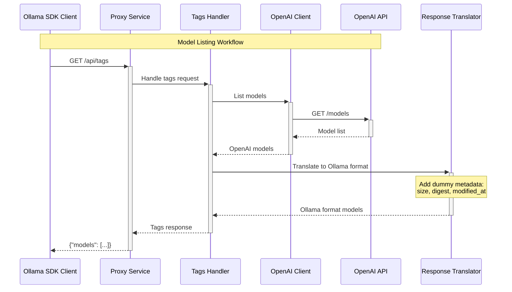

# Core Workflows

```mermaid
sequenceDiagram
    participant Client as Ollama SDK Client
    participant Proxy as Proxy Service
    participant Router as Request Router
    participant ReqTrans as Request Translator
    participant OpenAI as OpenAI Client
    participant API as OpenAI API
    participant RespTrans as Response Translator
    
    Note over Client,API: Text Generation Workflow (Streaming)
    
    Client->>+Proxy: POST /api/generate<br/>{model, prompt, stream: true}
    Proxy->>+Router: Route request
    Router->>+ReqTrans: Translate to OpenAI format
    Note over ReqTrans: Map parameters:<br/>num_predict → max_tokens<br/>temperature → temperature
    ReqTrans->>+OpenAI: Create chat completion request
    OpenAI->>+API: POST /chat/completions<br/>{stream: true}
    
    loop Streaming chunks
        API-->>-OpenAI: SSE chunk
        OpenAI-->>RespTrans: OpenAI chunk
        RespTrans-->>Proxy: Ollama format chunk
        Proxy-->>Client: SSE response chunk
    end
    
    OpenAI-->>-RespTrans: Stream complete
    RespTrans-->>-Router: Format final response
    Router-->>-Proxy: Complete
    Proxy-->>-Client: Stream end
```


