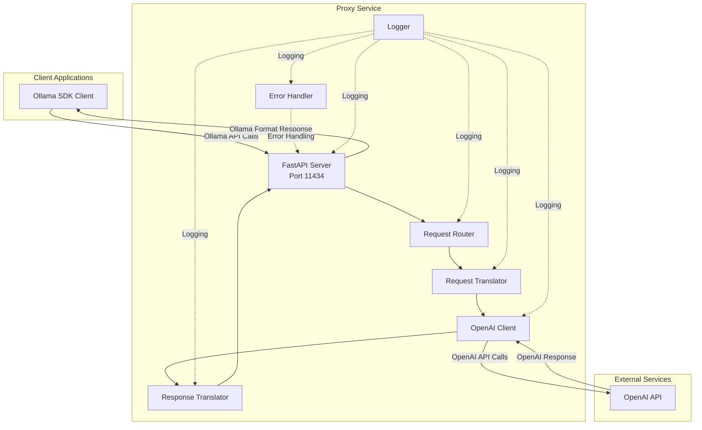

# High Level Architecture

## Technical Summary

The Ollama-to-OpenAI Proxy Service implements a monolithic REST API translation layer that enables zero-code migration from Ollama to OpenAI-compatible services. Built with FastAPI and Python 3.12, it provides transparent proxy functionality maintaining full Ollama SDK compatibility through request/response translation patterns. The architecture follows KISS principles, avoiding unnecessary complexity while ensuring < 50ms proxy overhead and supporting 100+ concurrent requests. This design directly supports the PRD goal of allowing teams to leverage cloud-scale LLM services without modifying existing Ollama-based codebases.

## High Level Overview

1. **Architectural Style**: Monolithic REST API Service with Translation Layer
2. **Repository Structure**: Monorepo (as per PRD requirement)
3. **Service Architecture**: Single monolithic service handling all proxy functionality
4. **Primary Data Flow**: 
   - Ollama SDK Client → HTTP Request → Proxy Service (port 11434)
   - Request Translation Layer → OpenAI API Client
   - OpenAI Response → Response Translation Layer → Ollama Format Response
5. **Key Architectural Decisions**:
   - Monolithic design for simplicity and reduced operational complexity
   - Stateless service design for horizontal scalability
   - In-memory request/response translation without persistence
   - Direct API-to-API translation without caching layer

## High Level Project Diagram

## Architectural and Design Patterns

- **API Gateway Pattern:** Single entry point for all Ollama API requests - _Rationale:_ Simplifies client configuration and provides centralized request handling
- **Adapter Pattern:** Request/Response translators adapt between Ollama and OpenAI formats - _Rationale:_ Clean separation of translation logic enables independent testing and maintenance
- **Repository Pattern:** Not applicable (no database) - _Rationale:_ KISS principle, avoiding unnecessary persistence layer
- **Dependency Injection:** FastAPI's built-in DI for OpenAI client and configuration - _Rationale:_ Enables easy testing and configuration management
- **Streaming Response Pattern:** Server-Sent Events (SSE) for streaming endpoints - _Rationale:_ Maintains real-time performance for streaming text generation
- **Error Translation Pattern:** Centralized error mapping between API formats - _Rationale:_ Consistent error handling and proper status code translation
